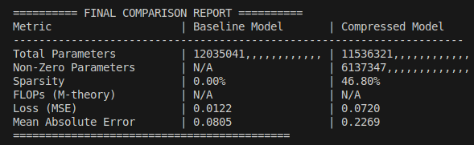

# hey 本库基于hls4ml开发 旨在fpga上部署midas_small与sml 实现水下场景的使用
******************************************************
# 介绍
## 模型组件
- **model**        包含模型定义
    - *midas_small_v2.py* midas模型 全部使用hls4ml适配函数编写
    - *prune_midas_v1.py* 以midasv2为基础 带有剪枝包装与优化器
    - （midas_small_v1 输出层带有relu会突然死亡 不再使用）
- **dataloader**
    - *load_nyu_v12*从硬盘中分步读取.mat文件中的内容 用于在个人终端训练
- **dataset**
    - 存放数据集(.mat)格式
- **model_pic**
    - 存放模型训练loss mae损失曲线
- **result**
    - 存放训练完成的不同版本模型
- **save_model**
    - 效果同result 用于 compare
- **训练**
    - *run_midas_v12.py* 在个人终端的baseline模型训练 需要配合dataloader
    - *run_midas_v14.py* 在服务器端的baseline模型训练 速度是个人终端的30倍
    - *run_prune_v2* 在服务器端的剪枝模型训练 使用了callbacks_v2 优化训练保存流程

## **inference**
- **input**
    - 内部放任意分辨率 .jpg .png .jpeg  用于inference 
- **output**
    - 输出input内图片的深度图
- **predict**
    - predictor.py 定义Class Predictor 用于inference
- *run_inference_v1* 调用训练好的网络输出深度预测结果

## **comparsion**
- *comparator.py*  定义Class Comparator 用于compare
- *run_comparsion_v1* 对比基线模型与优化后模型的 参数量 稀疏度 loss mse

### *callbacks* 
- 用于定义训练callback 
- v2实现Callbacks类 优化剪枝模型训练保存流程

### *environment*
- *environment2.yaml* 保存至 0712 v1版本为止的 所有依赖

### *test*
- *test1.py* 读.mat文件 往input里存jpg
- *test2.py* 往input文件夹保存数据集文件.npy用于测试
- *test6.py* 逐层输出模型每层的输出

# 运行结果
## 剪枝

# 开发日志
## 0707 v1
*model*文件夹中是 模型原型 

现已完成 Midas_samll 的 tensorflow复现
******************************************************
Total params: 12035041 (45.91 MB)
Trainable params: 11960929 (45.63 MB)
Non-trainable params: 74112 (289.50 KB)
******************************************************
添加environment.yaml 保证环境稳定 在宿主机装有CUDA时 记得unset LD_LIBRARY_PATH
******************************************************
0709 v4
现已完成 服务器训练全流程
训练了基于NYU深度数据集的midas_small
模型保存在服务器的result文件夹中
最新的conda环境在environment1.txt

run_midas 
            
        v11  最初dataloader版本 导致内存爆炸
          
        v12  可以在笔记本上训练的小pipeline
          
        v13  服务器特化版本 使用python实现并行 GPU利用率低
          
        v14  服务器优化完成版本 高并行度光速训练 速度是v2的30倍

dataloader 中bv11 v12分别匹配 run的 v11 v12

要使用这个库进行基于NYU-v2的tensorflow训练
    0.cd 到工程根目录
    
    1.conda env create -f environment1.txt
    
    2.进入kerasv20
    
    3.下载NYU数据集 创建dataset文件夹 放到该文件夹中
    
    4.运行run_midas_v14(服务器) 或者 run_midas_v12（小规模）
******************************************************
下一步做 1.剪枝   2.使用Qkeras进行替换 实现量化 3.送入hls4ml进行综合

完成后 同理移植SML 进行仿真 查看效果与资源 

再下一步 实现完整的 GA+VIO+SML流程
******************************************************
0710 v1
实现模型验证

    1.输入图片（jpg,png,jpeg）放入input

    2.默认调用midas_samll_v2 运行run_inference_v1.py

    3.输出到output

添加了一些测试功能 test v1 至 v6

目前模型在NYU上拟合的很好 但是拓展性较差

总之先跑完剪枝流程
******************************************************
0710 v2
完成剪枝

新增功能代码:
            prune_midas_v1 经过包装与编译的 可剪枝新模型

            run_prune_midas_v1 用于在服务器上训练的 剪枝训练模型

核心功能代码：

            callbacks 继承了多种callback，已经实现callback_prune 极大优化训练流程
******************************************************
0711 v1

----------------------------------------------------------------------
           
===========================================
完成对比 完成剪枝 下一步进行对剪枝后模型的hlsconfig

### 0712 v1 
- #### 修改readme.md 整理工程结构

### 0725 v1
- #### 增加tuner 增加贝叶斯搜索 完成模型优化全部任务模块
- #### 修改predictor,使其支持qkeras

### 0725 v2
- #### 修改tuner 设定不同的int 避免网络僵死
- #### 准备增加HGQ 用于对比量化结果